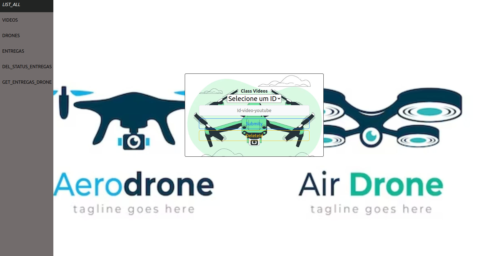
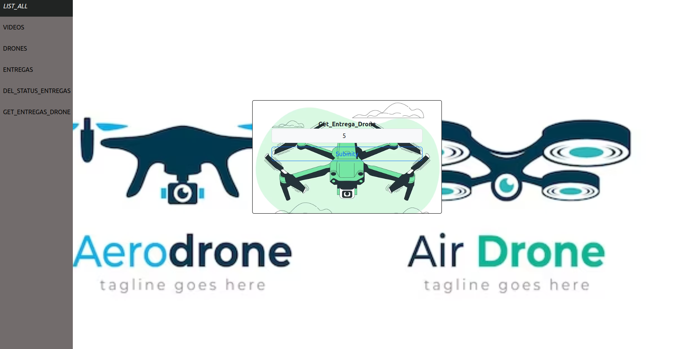

# drone-front-end
Projeto ReactJs com Vite, frontEnd do backEnd drone-feeder.
# :construction: PROJETO FRONT_END DRONE-FEEDER! :construction:

## Projeto REALIZADO para construir o front-end a partir do back-end Spring-Boot da aceleração java:
## Para rodar o back-end seguir os passos deste projeto, link abaixo:
`https://github.com/reinaldoper/drone-feeder`
# 📁 Acesso ao projeto
- `git clone git@github.com:reinaldoper/drone-front-end.git`
# 🛠️ Abrir e rodar o projeto
- Dentro da pasta raiz do projeto:
- `npm install`
- `npm run dev`
- Gerar uma imagem no docker a partir do Dockerfile:
- `docker build -t <nome-sua-preferência> .`
- Rodar a imagem no docker:
- `docker run -p 3000:3000 -d <nome-sua-preferência>`
## Para adicionar um video a base de dados, inserir apenas o ID do video(youTube), exemplo abaixo:
`n8Th7fGSiHye`
## Tela da classe videos:

Tela de entregas:

